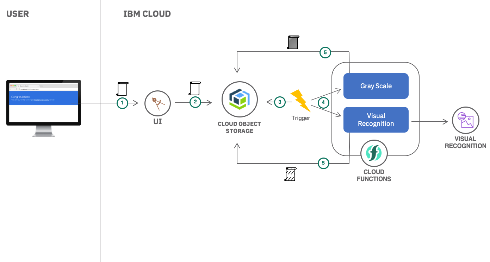

# cos-functions-pattern
## Summary
This pattern will set up a sample application to teach you about using IBM Cloud Object Storage from IBM Cloud Functions. There is also a web application component of this application, which will teach you about using the IBM Cloud Object Storage SDK for Node.js. In this application you will upload an image. That image will be stored in Cloud Object Storage, which will trigger your Serverless Cloud Functions to run. Those Cloud Functions will do some image processing and analysis - charcoaling the image and running visual recognition on the image. After the analysis and processing is done, the results will be stored in a different Cloud Object Storage Bucket, which can then be read from.

## Architecture
   

## Instructions
### Prerequisites
1. An [IBM Cloud Account](https://cloud.ibm.com/register)
1. An [IBM Cloud CLI](https://cloud.ibm.com/docs/cli/reference/ibmcloud?topic=cloud-cli-install-ibmcloud-cli#install_use) with the IBM Cloud Functions [Plugin](https://cloud.ibm.com/docs/openwhisk?topic=cloud-functions-cli_install) installed.

### Create Required Services on IBM Cloud
To run this application, you'll need to set up IBM Object Storage and the IBM Visual Recognition Service on IBM Cloud
1. Create a Cloud Object Storage Service Instance:
    * From the catalog select [Object Storage](https://cloud.ibm.com/catalog/services/cloud-object-storage).
    * Give your service a name, and click `Create`.
    * In the left side menu, select `Buckets`, and then `Create bucket`.
    * Give your bucket a unique name. 
    * For Resiliency, select `Cross Region`, and for Location, select `us-geo`.
    * Click `Create Bucket`.
    * Create another bucket, with the same name suffixed by `-processed`. If your original bucket was `my-bucket`, then your new bucket will be `my-bucket-processed`.
    * Again, ensure that you select `Cross Region` and `us-geo`.
    * In the left side menu, click `Service Credentials`. Click `New Credential`.
    * Check the checkbox for `Include HMAC Credential`. Click `Add`.

1. Create a Visual Recognition Service Instance
    * From the catalog select [Visual Recognition](https://cloud.ibm.com/catalog/services/visual-recognition)
    * Give your service a name, and click `Create`.
    * In the left side menu, click `Service Credentials`. If there are no service credentials created, click `New Credential`. Once your Service Credentials are created, make note of your `apikey`.

### Login and set up your IBM Cloud CLI with Functions plugin
1. Login to the IBM Cloud CLI:
    ```
    ibmcloud login
    ```

1. List the namespaces available in IBM Cloud Functions:
    ```
    ibmcloud fn namespace list
    ```

1. Set your namespace using the ID found in the previous step:
    ```
    ibmcloud fn property set --namespace <namespace_id>
    ```

### Create the Cloud Object Storage Experimental Package Binding
IBM Cloud Functions has recently created an experimental package that introduces a feed action used during trigger creation to configure bucket-specific events. We will create a package binding to make the `whisk.system/cos-experimental` package avaliable in our namespace. This will enable us to set our own parameters on the package, such as required credentials.

1. Create the package binding:
    ```
    ibmcloud fn package bind /whisk.system/cos-experimental myCosPkg
    ```

1. The service bind command requires your CloudFoundry API endpoint to be set. Let's set that now:
    ```
    ibmcloud target --cf
    ```

1. Bind your Cloud Object Storage credentials to your package binding:
    ```
    ibmcloud fn service bind cloud-object-storage myCosPkg
    ```

### Create Required Environment Variables and Deploy Cloud Functions
To deploy the functions required in this application, we'll use the `ibm fn deploy` command. This command will look for a `manifest.yaml` file defining a collection of packages, actions, triggers, and rules to be deployed. 
1. Let's clone the application.
    ```
    git clone git@github.com:beemarie/cos-functions-pattern.git
    ```

1. Take a look at the `serverless/manifest.yaml file`. You should see manifest describing the various actions, triggers, packages, and sequences to be created. You will also notice that there are a number of environment variables you should set locally before running this manifest file.

1. Choose a package name, trigger name, and rule name and then save the environment variables.
    ```
    export PACKAGE_NAME=<your_chosen_package_name>
    export RULE_NAME=<your_chosen_rule_name>
    export TRIGGER_NAME=<your_chosen_trigger_name>
    ```

1. You already chose a bucket name earlier when creating your COS Instance. Save that name as your BUCKET_NAME environment variable:
    ```
    export BUCKET_NAME=<your_bucket_name>
    ```

1. You will need to save the endpoint name, which is the COS Endpoint for your buckets. Since you selected us-geo when selecting your buckets, the endpoint should be `s3.us.cloud-object-storage.appdomain.cloud`
    ```
    export ENDPOINT=s3.us.cloud-object-storage.appdomain.cloud
    ```

1. Finally, you will need some information from the Visual Recognition service.  You saved your apikey earlier, so use that. This application is built against the version released on `2018-03-19`, so we'll use that value for VERSION.
    ```
    export API_KEY=<your_visual_recognition apikey>
    export VERSION=2018-03-19
    ```

1. You've set up some required credentials and various parameters for your IBM Cloud Functions. Let's deploy the functions now! Change directories to the `serverless` folder, and then deploy the functions.
    ```
    cd serverless
    ibmcloud fn deploy
    ```

### Bind Service Credentials to the Created Cloud Object Storage Package
1. The deploy command created a package for you called `cloud-object-storage`. This package contains some useful cloud functions for interacting with cloud object storage. Let's bind the service credentials to this package.
    ```
    ibmcloud fn service bind cloud-object-storage cloud-object-storage
    ```

1. Congratulations! If you went directly to your cloud object storage bucket and added a file, you should see your trigger fire and some processed actions showing up in your `mybucket-processed` bucket. Let's deploy a simple application for uploading the images and showing these results.

### Deploy the Web Application
Finally, let's deploy the web application that enables our users to upload images and see the resulting images. The application is a node.js with express app, and we can deploy it to IBM Cloud using the manifest.yaml file provided in the `/app` folder.
1. Change directories to the `app` folder:
    ```
    cd ../app
    ```
  
1. Update the `config.json` file with the required configuration values: your bucket name, your processed bucket name, and your endpoint url. You should've already found these values earlier.

1. Create a file named `credentials.json` based on the `credentials_template.json` file. You can easily get the credentails by going to the cloud object storage service page, and clicking `Service Credentials`. You can copy this entire block and paste it as a child to `"OBJECTSTORAGE_CREDENTIALS":`.

1. Open up the manifest.yaml file at `app/manifest.yaml`. You should see something like this:
    ```
    ---
    applications:
    - name: cos-image-writer
      memory: 256M
      instances: 1
    ```

    This manifest file describes the cloud foundry application we're about to deploy. Please rename the application to anything you would like. 

1. Deploy the application:
    ```
    ibmcloud cf push
    ```

1. Finally, we'll need to update the CORS settings on our processed images bucket.  The `cloud-object-storage` package we installed earlier comes with a method to let us do that. Run the following command, but be sure to edit it first with your own `-processed` bucket name.
    ```
    ibmcloud fn action invoke cloud-object-storage/bucket-cors-put -b -p bucket myBucket-processed -p corsConfig "{\"CORSRules\":[{\"AllowedHeaders\":[\"*\"], \"AllowedMethods\":[\"POST\",\"GET\",\"DELETE\"], \"AllowedOrigins\":[\"*\"]}]}"
    ```

1. You should now be able to use the application you deployed! When the application was deployed, it should've output a URL where your application lives, something like `my-app-name.mybluemix.net`. You can now go there and start uploading images and seeing your results!